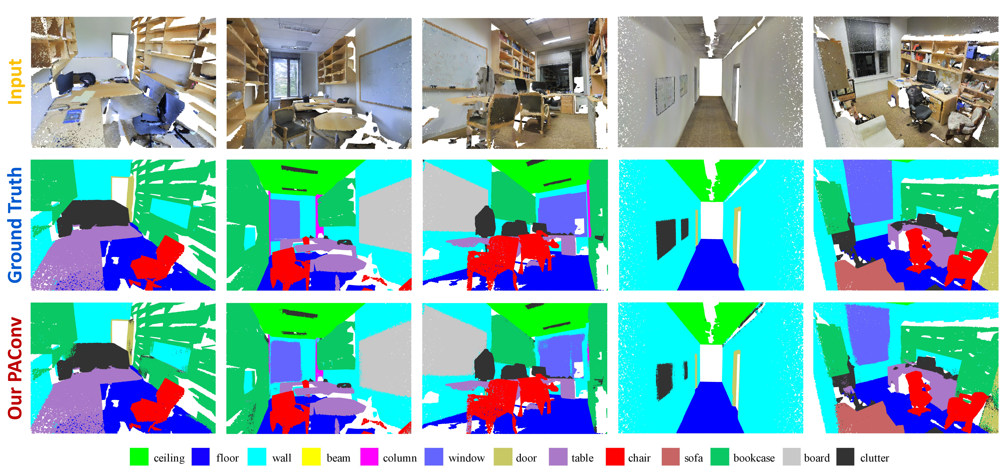

# 3D Semantic Segmentation





## Installation

### Requirements
   - Hardware: 1 GPU
   - Software: 
      PyTorch>=1.5.0, Python>=3, CUDA>=10.2, tensorboardX, tqdm, h5py, pyYaml

### Dataset
- Download S3DIS [dataset](https://drive.google.com/drive/folders/12wLblskNVBUeryt1xaJTQlIoJac2WehV) and symlink the paths to them as follows (you can alternatively modify the relevant paths specified in folder `config`):
    ```
     mkdir -p dataset
     ln -s /path_to_s3dis_dataset dataset/s3dis
     ```

## Usage

1. Requirement:

   - Hardware: 1 GPU to hold 6000MB for CUDA version, 2 GPUs to hold 10000MB for non-CUDA version.
   - Software: 
      PyTorch>=1.5.0, Python3.7, CUDA>=10.2, tensorboardX, tqdm, h5py, pyYaml

2. Train:

   - Specify the gpu used in config and then do training:

     ```shell
     sh tool/train.sh s3dis pointnet2_paconv                   # non-cuda version
     sh tool/train.sh s3dis pointnet2_paconv_cuda              # cuda version
     ```

3. Test:

   - Download [pretrained models](https://drive.google.com/drive/mobile/folders/10UAEjEIZLjnUndyORygwAW289kW9xMc7/1z5cRUG5d01d78rShJ2qbePMJqqiWzo4d/1zpmr_ircZduiVWDEe8yC-zQ1AfIn4GZF?usp=sharing&sort=13&direction=a) and put them under folder specified in config or modify the specified paths. 
Our CUDA-implemented PAConv achieves [66.01](https://drive.google.com/drive/folders/1h-ZusRArRpB-8T9lZe3FRYZJA3Hm7_ua) mIoU (w/o voting) and vanilla PAConv without CUDA achieves [66.33](https://drive.google.com/drive/folders/1AacPodXqK6OO-IGnVd1pPLx7pNMMhzW0) mIoU (w/o voting) in s3dis Area-5 validation set.

   - For full testing (get listed performance):

     ```shell
     CUDA_VISIBLE_DEVICES=0 sh tool/test.sh s3dis pointnet2_paconv        # non-cuda version
     CUDA_VISIBLE_DEVICES=0 sh tool/test.sh s3dis pointnet2_paconv_cuda   # cuda version
     ```
    
   - For 6-fold validation (calculating the metrics with results from different folds merged): 
     1) Change the [test_area index](https://github.com/CVMI-Lab/PAConv/blob/main/scene_seg/config/s3dis/s3dis_pointnet2_paconv.yaml#L7) in the config file to 1;
     2) Finish full train and test, the test result files of Area-1 will be saved in corresponding paths after the test;
     3) Repeat a,b by changing the [test_area index](https://github.com/CVMI-Lab/PAConv/blob/main/scene_seg/config/s3dis/s3dis_pointnet2_paconv.yaml#L7) to 2,3,4,5,6 respectively;
     4) Collect all the test result files of all areas to one directory and state the path to this directory [here](https://github.com/CVMI-Lab/PAConv/blob/main/scene_seg/tool/test_s3dis_6fold.py#L52);
     5) Run the code for 6-fold validation to get the final 6-fold results:
        ```shell
        python test_s3dis_6fold.py
        ```
        
    
   
[comment]: <> (5. Visualization: [tensorboardX]&#40;https://github.com/lanpa/tensorboardX&#41; incorporated for better visualization.)

[comment]: <> (   ```shell)

[comment]: <> (   tensorboard --logdir=run1:$EXP1,run2:$EXP2 --port=6789)

[comment]: <> (   ```)


[comment]: <> (6. Other:)

[comment]: <> (   - Video predictions: Youtube [LINK]&#40;&#41;.)


## Citation

If you find our work helpful in your research, please consider citing:

```
@inproceedings{xu2021paconv,
  title={PAConv: Position Adaptive Convolution with Dynamic Kernel Assembling on Point Clouds},
  author={Xu, Mutian and Ding, Runyu and Zhao, Hengshuang and Qi, Xiaojuan},
  booktitle={CVPR},
  year={2021}
}
```

## Contact
 
You are welcome to send pull requests or share some ideas with us. Contact information: Mutian Xu (mino1018@outlook.com) or Runyu Ding (ryding@eee.hku.hk).

## Acknowledgement
The code is partially borrowed from [PointWeb](https://github.com/hszhao/PointWeb).
